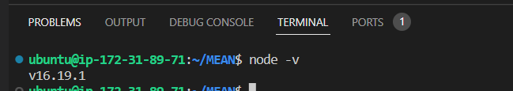
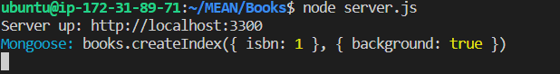
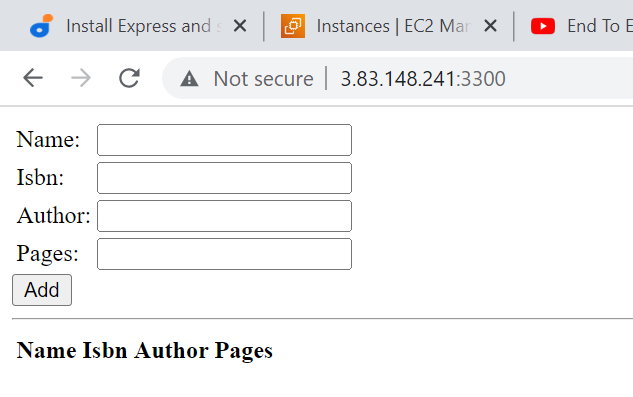

 ## STEP1 Install Nodejs

Update and upgrade ubuntu with the following commands

            $  sudo apt update
            $  sudo apt upgrade

  Add certificates by running

   $  sudo apt -y install curl dirmngr apt-transport-https lsb-release ca-certificates
   $  curl -fsSL https://deb.nodesource.com/setup_16.x | sudo -E bash -
   

   **Install Nodejs**
  
   $   sudo apt install -y nodejs

   Run node -v to confirm installation

   This is the output  

   ## STEP2 Install MOngoDB

   $  sudo apt-key adv --keyserver hkp://keyserver.ubuntu.com:80 --recv 0C49F3730359A14518585931BC711F9BA15703C6

  $   echo "deb [ arch=amd64 ] https://repo.mongodb.org/apt/ubuntu trusty/mongodb-org/3.4 multiverse" | sudo tee /etc/apt/sources.list.d/mongodb-org-3.4.list

  Install MongoDB with the following command :-

$   sudo apt install -y mongodb

 Start the server with this command

$  sudo service mongodb start

 Verify that the service is running with

$ sudo systemctl status mongodb

Install nmp- Node package manager

$  sudo apt install -y npm

**Install body-parser package**

Body-parser helpsus process JSON files passed in request to  the server

sudo npm install body-parser

Create a folder named ‘Books’ and cd into 'Books"

$ mkdir Books && cd Books

In the Books directory, Initialize npm project

   $  npm init

Create a file 'server.js' and vi into it and paste the code in codes.txt for server.js

  $  vi server.js

  ##  Step 3: Install Express and set up routes to the server

We need to install Express to pass book information to and from our MongoDB
and also install mongoose package which will help us esthablish a schema for the database to share data of our book register. So run 

 $  sudo npm install express mongoose

 In ‘Books’ folder, create a folder named 'apps' and vi into it

 $  mkdir apps && vi apps

 Create a file named 'routes.js' and vi into it.

 Copy and paste the commands in codes.txt file for routes.js

 In the ‘apps’ folder, create a folder named 'models' and cd into iyt

   $ mkdir models && cd models

   Create a file named 'book.js' and vi into it

      $  vi books.js

   Copy and and paste the code in codes.txt file for books.js

   ##  Step 4 – Access the routes with AngularJS

   cd into the Books directory
   
       $  cd ../..

       create a folder named public and cd into it

       $ mkdir public && cd public

Add a file named 'script.js' and vi into it and paste and save the commands in code.txt file for script.js file

In public folder, create a file named index.html and vi into it.
Copy and paste the codes found in codes.txt file for index.html file

cd into Books directory and start the server

    $  node server.js

The output is 

The outpot on the server when you run http://3.83.148.241:3300

